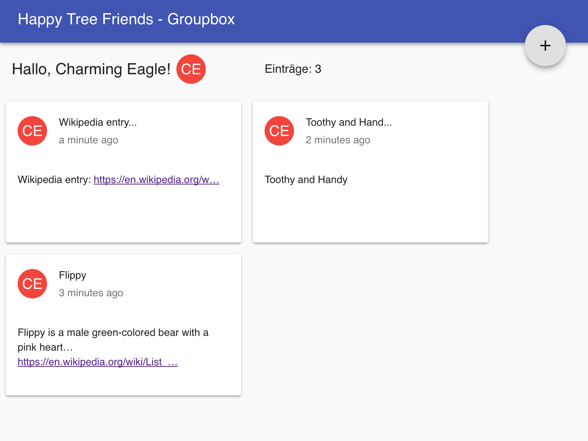

# groupbox
Ad-hoc online collaboration on information collections



Read more about Groupbox: [Details](doc/groupbox.md)

## frontend
```
cd frontend/build
yarn install
run // will display available 'run' tasks, e.g run docker:build
```

Read more about the build system: [read more ...](frontend/build/README.md)

Read more about Frontend Testing (Playground-UI): [read more ...](doc/cosmos.md)

## backend
```
cd backend/build
yarn install
run // will display available 'run' tasks, e.g run docker:build
```

[read more about Backend build system](backend/build/README.md)
