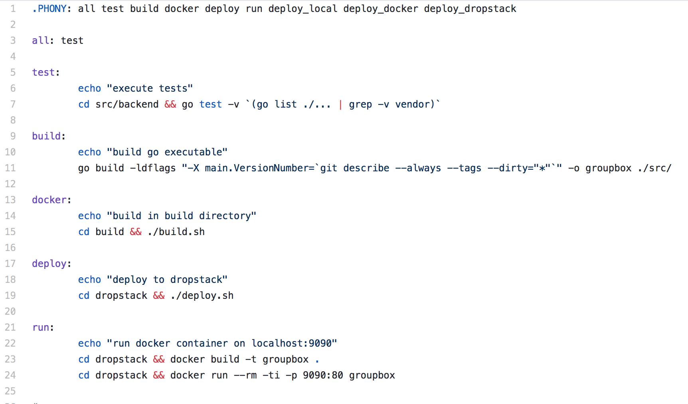
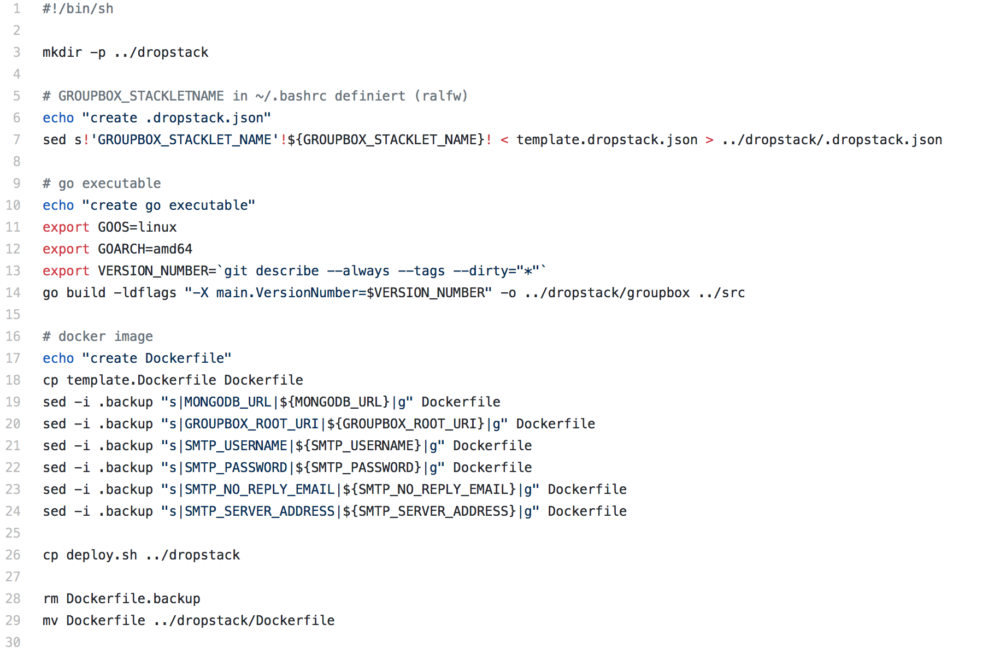
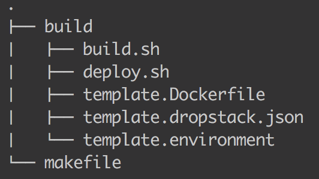
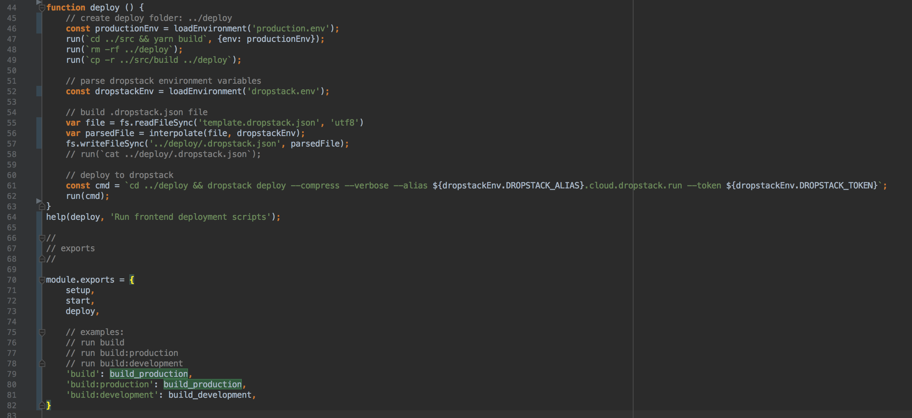
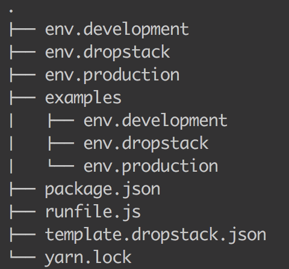

# Improving the build system

## Makefile

* limitations with Makefile: 
  * cannot load environment variables (need to be sourced before executing make)
  * every commando is executed in a new shell
  * parsing command line arguments not really possible
  


* too many tools: Makefile, shell scripts, sed, cp, mv
  * this leads to high coupling with the operating system
  * relying too much on the file structure
  * e.g replace environment variables in files: `sed -i .backup "s|MONGODB_URL|${MONGODB_URL}|g" Dockerfile`






## runjs

* simple commandos on the CLI, like Makefiles (declarative)

`runjs` is super flexible with parsing CLI arguments: namespaces, options
```
run start
run build
run build:development
run build --env=production
```

* easy to write recipes/jobs/commandos
  * all the power of javascript
  * import npm packges (use existing libraries)

* easy to read, because we can structure the code the way we like





* leads to a better separation of concerns (Environment files, Template files)
  

source:

* https://hackernoon.com/simple-build-tools-npm-scripts-vs-makefile-vs-runjs-31e578278162
* https://kvz.io/blog/2016/02/18/a-universal-makefile-for-javascript/


# Improvements in File Structure

current structure, can lead to confusion
```
└── frontend
    ├── bin    // concern: build
    ├── build  // concern: build
    ├── deploy // concern: build
    └── src
```

simplified structure, make intent clear, single level of abstraction

v1)
```
└── frontend
    ├── build // all recipes and configs are in here, e.g. start, deploy, build, ...
    │   ├── bin.1803281438
    │   ├── bin.dev.1803281438
    │   └── deploy.1803281438
    └── src
```

v2)
```
└── frontend
    ├── run
    │   ├── bin.1803281438
    │   ├── bin.dev.1803281438
    │   └── deploy.1803281438
    └── src 
```